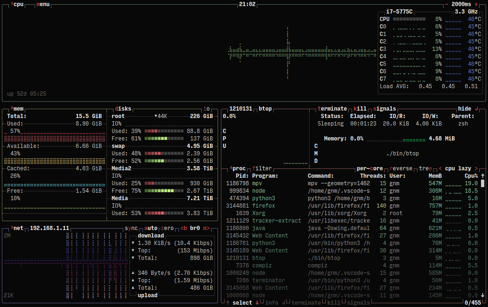
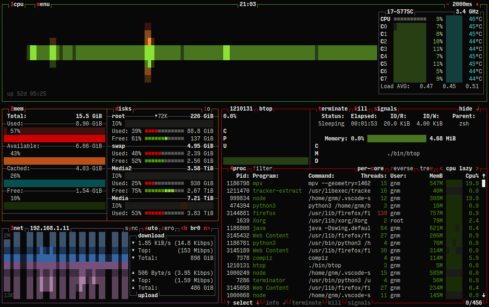
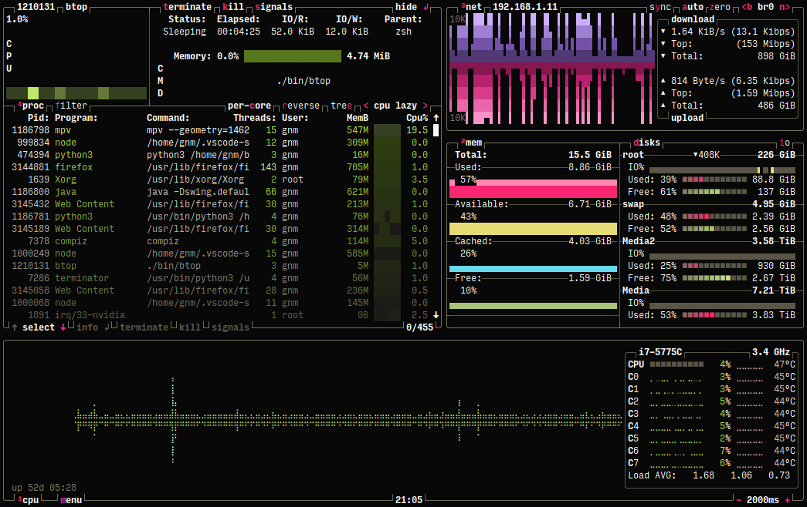
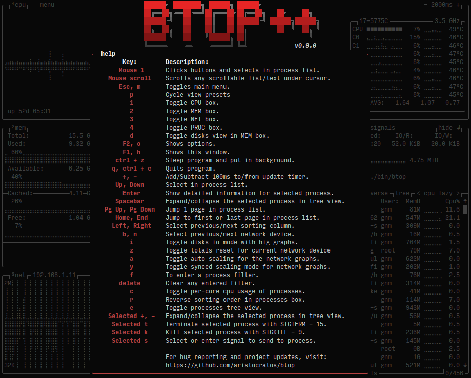

# 


[](https://paypal.me/aristocratos)
[](https://github.com/sponsors/aristocratos)
[](https://ko-fi.com/aristocratos)

## Index


* [News](#news)
* [Documents](#documents)
* [Description](#description)
* [Features](#features)
* [Themes](#themes)
* [Support and funding](#support-and-funding)
* [Prerequisites](#prerequisites) (Read this if you are having issues!)
* [Screenshots](#screenshots)
* [Keybindings](#help-menu)
* [Installation](#installation)
* [Manual compilation](#compilation)
* [Configurability](#configurability)
* [License](#license)

## News

### Under development

##### 5 May 2021

This project is gonna take some time until it has complete feature parity with bpytop, since all system information gathering will have to be written from scratch without any external libraries.
And will need some help in the form of code contributions to get complete support for BSD and OSX.

If you got suggestions of C++ libraries that are multi-platform and are as extensive as [psutil](https://github.com/giampaolo/psutil) are for python, feel free to open up a new thread in Discussions, it could help speed up the development a lot.

## Documents

**[CHANGELOG.md](CHANGELOG.md)**

**[CONTRIBUTING.md](CONTRIBUTING.md)**

**[CODE_OF_CONDUCT.md](CODE_OF_CONDUCT.md)**

## Description

Resource monitor that shows usage and stats for processor, memory, disks, network and processes.

C++ version and continuation of [bashtop](https://github.com/aristocratos/bashtop) and [bpytop](https://github.com/aristocratos/bpytop).

## Features

* Easy to use, with a game inspired menu system.
* Full mouse support, all buttons with a highlighted key is clickable and mouse scroll works in process list and menu boxes.
* Fast and responsive UI with UP, DOWN keys process selection.
* Function for showing detailed stats for selected process.
* Ability to filter processes, multiple filters can be entered.
* Easy switching between sorting options.
* Send SIGTERM, SIGKILL, SIGINT to selected process.
* UI menu for changing all config file options.
* Auto scaling graph for network usage.
* Shows message in menu if new version is available
* Shows current read and write speeds for disks

## Themes

Btop++ uses the same theme files as bpytop and bashtop (some color values missing in bashtop themes) .

See [themes](https://github.com/aristocratos/btop/tree/master/themes) folder for available themes.

The `make install` command places the default themes in `[$PREFIX or /usr/local]/share/btop/themes`.
User created themes should be placed in `$XDG_CONFIG_HOME/btop/themes` or `$HOME/.config/btop/themes`.

Let me know if you want to contribute with new themes.

## Support and funding

You can sponsor this project through github, see [my sponsors page](https://github.com/sponsors/aristocratos) for options.

Or donate through [paypal](https://paypal.me/aristocratos) or [ko-fi](https://ko-fi.com/aristocratos).

Any support is greatly appreciated!

## Prerequisites

For best experience, a terminal with support for:

* 24-bit truecolor ([See list of terminals with truecolor support](https://gist.github.com/XVilka/8346728))
* 256-color terminals are supported through 24-bit to 256-color conversion when setting "truecolor" to False in the options or with "-lc/--low-color" arguments.
* 16 color TTY mode will be activated if a real tty device is detected. Can be forced with "-t/--tty_on" arguments.
* Wide characters (Are sometimes problematic in web-based terminals)

Also needs a UTF8 locale and a font that covers:

* Unicode Block “Braille Patterns” U+2800 - U+28FF (Not needed in TTY mode or with graphs set to type: block or tty.)
* Unicode Block “Geometric Shapes” U+25A0 - U+25FF
* Unicode Block "Box Drawing" and "Block Elements" U+2500 - U+259F

### **Notice (Text rendering issues)**

* If you are having problems with the characters in the graphs not looking like they do in the screenshots, it's likely a problem with your systems configured fallback font not having support for braille characters.

* See [Terminess Powerline](https://github.com/ryanoasis/nerd-fonts/tree/master/patched-fonts/Terminus/terminus-ttf-4.40.1) for an example of a font that includes the braille symbols.

* See comments by @sgleizes [link](https://github.com/aristocratos/bpytop/issues/100#issuecomment-684036827) and @XenHat [link](https://github.com/aristocratos/bpytop/issues/100#issuecomment-691585587) in issue #100 for possible solutions.

* If text are misaligned and you are using Konsole or Yakuake, turning off "Bi-Directional text rendering" is a possible fix.

* Characters clipping in to each other or text/border misalignments is not bugs caused by btop, but most likely a fontconfig or terminal problem where the braille characters making up the graphs aren't rendered correctly.

* Look to the creators of the terminal emulator you use to fix these issues if the previous mentioned fixes don't work for you.

## Screenshots

#### Main UI showing details for a selected process



#### Main UI in TTY mode



#### Main UI with custom options



#### Main-menu


#### Options-menu


#### Help-menu



## Installation

**Binary release (statically compiled)**

1. **Download btop-(VERSION)-(ARCH).tbz from latest release and unpack to a new folder**

2. **Install (from created folder)**

   * **Run install.sh or:**

   ``` bash
   # use "make install PREFIX=/target/dir" to set target, default: /usr/local
   # only use "sudo" when installing to a NON user owned directory
   sudo make install
   ```

3. **(Optional) Set suid bit to make btop always run as root (or other user)**

   Enables signal sending to any process without starting with `sudo` and can prevent /proc read permissions problems on some systems.

   * **Run setuid.sh or:**

   ``` bash
   # run after make install and use same PREFIX if any was used at install
   # set SU_USER and SU_GROUP to select user and group, default is root:root
   sudo make setuid
   ```

* **Uninstall**

  * **Run uninstall.sh or:**

   ``` bash
   sudo make uninstall
   ```

* **Show help**

   ```bash
   make help
   ```

## Compilation

   Needs GCC 10 or higher, (GCC 11 or above strongly recommended for better CPU efficiency in the compiled binary).

   Only 64-bit for now.

   The makefile also needs GNU coreutils and `sed` (should already be installed on any modern distribution).

1. **Install dependencies (example for Ubuntu 21.04 Hirsute)**

   ``` bash
   sudo apt install coreutils sed git build-essential gcc-11 g++-11
   # use gcc-10 g++-10 if gcc-11 isn't available
   ```

2. **Clone repository**

   ``` bash
   git clone https://github.com/aristocratos/btop.git
   cd btop
   ```

3. **Compile**

   Append `STATIC=true` to `make` command for static compilation.

   Notice! Manually set `$ARCH` variable if cross-compiling

   Use `$ADDFLAGS` variable for appending flags to both compiler and linker.

   ``` bash
   make
   ```

4. **Install**

   ``` bash
   # use "make install PREFIX=/target/dir" to set target, default: /usr/local
   # only use "sudo" when installing to a NON user owned directory
   sudo make install
   ```

5. **(Optional) Set suid bit to make btop always run as root (or other user)**

   No need for `sudo` to enable signal sending to any process and to prevent /proc read permissions problems on some systems.

   ``` bash
   # run after make install and use same PREFIX if any was used at install
   # set SU_USER and SU_GROUP to select user and group, default is root:root
   sudo make setuid
   ```

* **Uninstall**

   ``` bash
   sudo make uninstall
   ```

* **Remove any object files from source dir**

   ```bash
   make clean
   ```

* **Remove all object files, binaries and created directories in source dir**

   ```bash
   make distclean
   ```

* **Show help**

   ```bash
   make help
   ```

## Configurability

All options changeable from within UI.
Config and log files stored in `$XDG_CONFIG_HOME/btop` or `$HOME/.config/btop` folder

#### btop.cfg: (auto generated if not found)

```bash
#? Config file for btop v. 0.9.0

#* Name of a btop++/bpytop/bashtop formatted ".theme" file, "Default" and "TTY" for builtin themes.
#* Themes should be placed in "../share/btop/themes" relative to binary or "$HOME/.config/btop/themes"
color_theme = "Default"

#* If the theme set background should be shown, set to False if you want terminal background transparency.
theme_background = False

#* Sets if 24-bit truecolor should be used, will convert 24-bit colors to 256 color (6x6x6 color cube) if false.
truecolor = True

#* Set to true to force tty mode regardless if a real tty has been detected or not.
#* Will force 16-color mode and TTY theme, set all graph symbols to "tty" and swap out other non tty friendly symbols.
force_tty = False

#* Rounded corners on boxes, is ignored if TTY mode is ON.
rounded_corners = True

#* Default symbols to use for graph creation, "braille", "block" or "tty".
#* "braille" offers the highest resolution but might not be included in all fonts.
#* "block" has half the resolution of braille but uses more common characters.
#* "tty" uses only 3 different symbols but will work with most fonts and should work in a real TTY.
#* Note that "tty" only has half the horizontal resolution of the other two, so will show a shorter historical view.
graph_symbol = "braille"

# Graph symbol to use for graphs in cpu box, "default", "braille", "block" or "tty".
graph_symbol_cpu = "default"

# Graph symbol to use for graphs in cpu box, "default", "braille", "block" or "tty".
graph_symbol_mem = "default"

# Graph symbol to use for graphs in cpu box, "default", "braille", "block" or "tty".
graph_symbol_net = "default"

# Graph symbol to use for graphs in cpu box, "default", "braille", "block" or "tty".
graph_symbol_proc = "default"

#* Manually set which boxes to show. Available values are "cpu mem net proc", separate values with whitespace.
shown_boxes = "cpu mem net proc"

#* Update time in milliseconds, recommended 2000 ms or above for better sample times for graphs.
update_ms = 2000

#* Processes sorting, "pid" "program" "arguments" "threads" "user" "memory" "cpu lazy" "cpu responsive",
#* "cpu lazy" sorts top process over time (easier to follow), "cpu responsive" updates top process directly.
proc_sorting = "cpu lazy"

#* Reverse sorting order, True or False.
proc_reversed = False

#* Show processes as a tree.
proc_tree = False

#* Use the cpu graph colors in the process list.
proc_colors = True

#* Use a darkening gradient in the process list.
proc_gradient = True

#* If process cpu usage should be of the core it's running on or usage of the total available cpu power.
proc_per_core = True

#* Show process memory as bytes instead of percent.
proc_mem_bytes = True

#* Use /proc/[pid]/smaps for memory information in the process info box (very slow but more accurate)
proc_info_smaps = False

#* Show proc box on left side of screen instead of right.
proc_left = False

#* Sets the CPU stat shown in upper half of the CPU graph, "total" is always available.
#* Select from a list of detected attributes from the options menu.
cpu_graph_upper = "total"

#* Sets the CPU stat shown in lower half of the CPU graph, "total" is always available.
#* Select from a list of detected attributes from the options menu.
cpu_graph_lower = "total"

#* Toggles if the lower CPU graph should be inverted.
cpu_invert_lower = True

#* Set to True to completely disable the lower CPU graph.
cpu_single_graph = False

#* Show cpu box at bottom of screen instead of top.
cpu_bottom = False

#* Shows the system uptime in the CPU box.
show_uptime = True

#* Show cpu temperature.
check_temp = True

#* Which sensor to use for cpu temperature, use options menu to select from list of available sensors.
cpu_sensor = "Auto"

#* Show temperatures for cpu cores also if check_temp is True and sensors has been found.
show_coretemp = True

#* Set a custom mapping between core and coretemp, can be needed on certain cpus to get correct temperature for correct core.
#* Use lm-sensors or similar to see which cores are reporting temperatures on your machine.
#* Format "x:y" x=core with wrong temp, y=core with correct temp, use space as separator between multiple entries.
#* Example: "4:0 5:1 6:3"
cpu_core_map = ""

#* Which temperature scale to use, available values: "celsius", "fahrenheit", "kelvin" and "rankine".
temp_scale = "celsius"

#* Show CPU frequency.
show_cpu_freq = True

#* Draw a clock at top of screen, formatting according to strftime, empty string to disable.
#* Special formatting: /host = hostname | /user = username | /uptime = system uptime
clock_format = "%H:%M"

#* Update main ui in background when menus are showing, set this to false if the menus is flickering too much for comfort.
background_update = True

#* Custom cpu model name, empty string to disable.
custom_cpu_name = ""

#* Optional filter for shown disks, should be full path of a mountpoint, separate multiple values with whitespace " ".
#* Begin line with "exclude=" to change to exclude filter, otherwise defaults to "most include" filter. Example: disks_filter="exclude=/boot /home/user".
disks_filter = "exclude=/boot"

#* Show graphs instead of meters for memory values.
mem_graphs = True

#* Show mem box below net box instead of above.
mem_below_net = False

#* If swap memory should be shown in memory box.
show_swap = True

#* Show swap as a disk, ignores show_swap value above, inserts itself after first disk.
swap_disk = True

#* If mem box should be split to also show disks info.
show_disks = True

#* Filter out non physical disks. Set this to False to include network disks, RAM disks and similar.
only_physical = True

#* Read disks list from /etc/fstab. This also disables only_physical.
use_fstab = False

#* Toggles if io activity % (disk busy time) should be shown in regular disk usage view.
show_io_stat = True

#* Toggles io mode for disks, showing big graphs for disk read/write speeds.
io_mode = False

#* Set to True to show combined read/write io graphs in io mode.
io_graph_combined = False

#* Set the top speed for the io graphs in MiB/s (100 by default), use format "mountpoint:speed" separate disks with whitespace " ".
#* Example: "/mnt/media:100 /:20 /boot:1".
io_graph_speeds = ""

#* Set fixed values for network graphs in Mebibits. Is only used if net_auto is also set to False.
net_download = 100

net_upload = 100

#* Use network graphs auto rescaling mode, ignores any values set above and rescales down to 10 Kibibytes at the lowest.
net_auto = True

#* Sync the auto scaling for download and upload to whichever currently has the highest scale.
net_sync = False

#* Starts with the Network Interface specified here.
net_iface = "br0"

#* Show battery stats in top right if battery is present.
show_battery = True

#* Set loglevel for "~/.config/btop/error.log" levels are: "ERROR" "WARNING" "INFO" "DEBUG".
#* The level set includes all lower levels, i.e. "DEBUG" will show all logging info.
log_level = "DEBUG"
```

#### Command line options

```text
usage: btop [-h] [-v] [-/+t] [--utf-foce] [--debug]

optional arguments:

  -h, --help            show this help message and exit
  -v, --version         show version info and exit
  -lc, --low-color      disable truecolor, converts 24-bit colors to 256-color
  -t, --tty_on          force (ON) tty mode, max 16 colors and tty friendly graph symbols
  +t, --tty_off         force (OFF) tty mode
  --utf-foce            force start even if no UTF-8 locale was detected
  --debug               start in DEBUG mode: shows microsecond timer for information collect
                        and screen draw functions and sets loglevel to DEBUG
```

## LICENSE

[Apache License 2.0](LICENSE)
